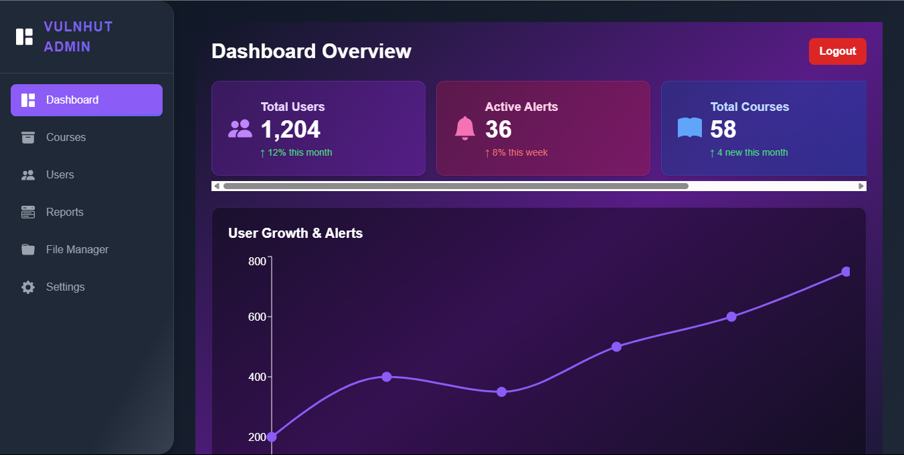

# 🔐 Vulnhut Admin Dashboard

The **Vulnhut Admin Dashboard** is a modern, responsive interface built using **React** and **Tailwind CSS**, designed to help administrators manage users, courses, reports, and settings with ease.

---

## 🚀 Features

* 🔑 Admin-only access control using `localStorage`
* 📊 Interactive charts with `recharts`
* 👥 User, Course, Report, and Settings modules
* 💡 Clean, dark UI inspired by Vulnhut design
* 📱 Fully responsive layout with sidebar navigation

---

## 🎯 Use Case / Application

This dashboard is designed for internal use by **administrators of Vulnhut**, a cybersecurity learning platform (or similar). It allows admins to:

* Manage users and their roles
* Create or modify course content
* Monitor platform activity via reports
* Adjust global settings from one place

> ✅ This kind of dashboard could be used by **edtech platforms**, **cybersecurity training tools**, or **admin control panels** for SaaS apps.

---

## 🗂️ Project Structure

```
vulnhut-admin/
├── public/
├── src/
│   ├── Header.jsx
│   ├── Sidebar.jsx
│   ├── App.jsx
│   ├── App.css
│   ├── main.jsx
│   └── pages/
│       ├── Dashboard.jsx
│       ├── Courses.jsx
│       ├── Users.jsx
│       ├── Reports.jsx
│       └── Settings.jsx
└── README.md
```

---

## 🛠️ Tech Stack

* **React.js**
* **Tailwind CSS**
* **Vite**
* **Recharts**
* **React Router DOM**

---

## 📦 Getting Started

### 1. Clone the repository

```bash
git clone https://github.com/riya810sri/vulnhut-admin.git
cd vulnhut-admin
```

### 2. Install dependencies

```bash
npm install
```

### 3. Start development server

```bash
npm run dev
```

Visit: [http://localhost:5173](http://localhost:5173)

---

## 🔐 Admin Login Flow

On successful login:

```js
localStorage.setItem("isAdmin", "true");
```

Unauthorized access is redirected to `/login`.

---

## 📦 Deployment (Optional)

To deploy using GitHub Pages, Netlify, or Vercel:

```bash
npm run build
```

Then follow the platform's deployment instructions.

---

## 📸 Preview (Add Screenshot)



---

## 📄 License

This project is licensed under the MIT License.
